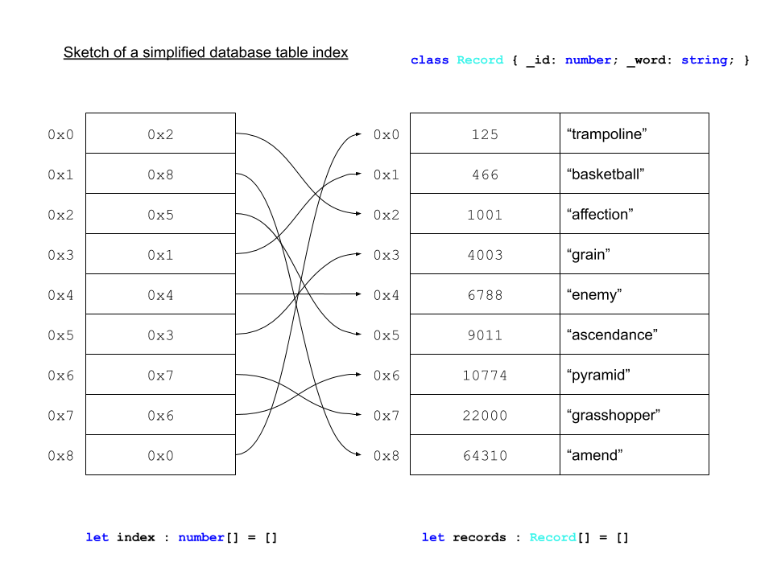
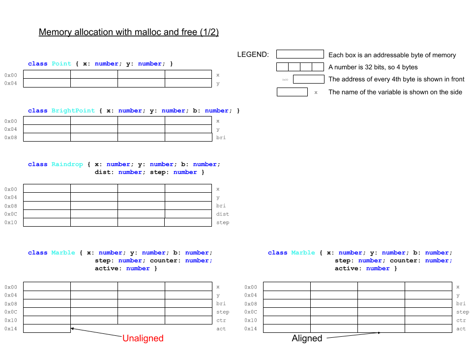
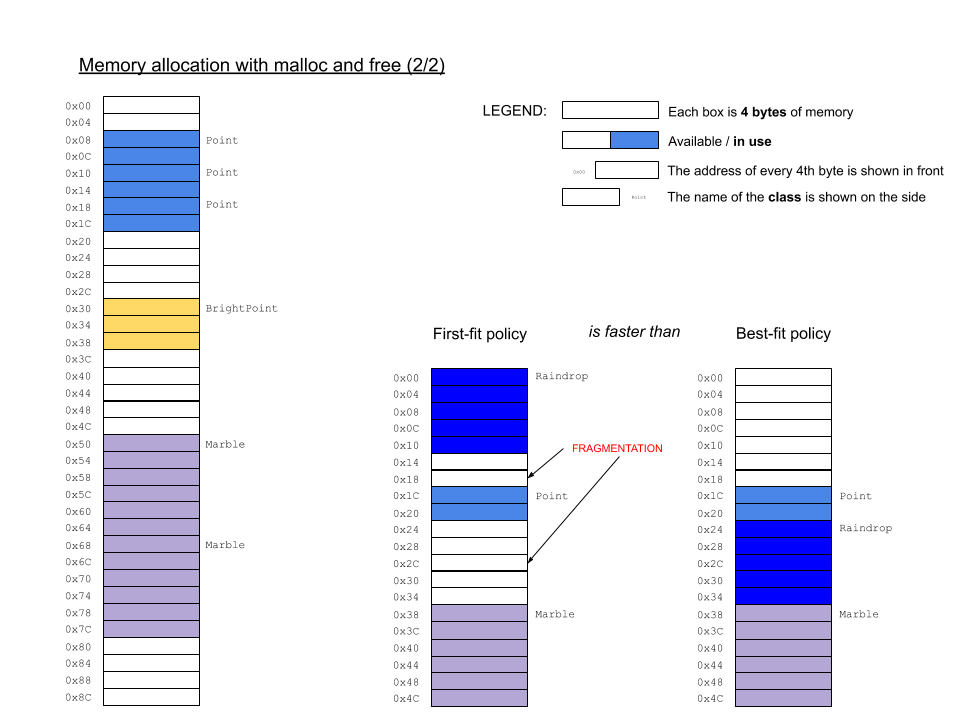

# CPE 1040 - Fall 2020

This is learning progression 004 for the Fall 2020 installment of the course CPE 1040: Introduction to Computer Engineering at MSU Denver.

Table of Contents
=================

* [CPE 1040 \- Fall 2020](#cpe-1040---fall-2020)
  * [Learning Progression 004: External LEDs](#learning-progression-004-external-leds)
    * [Step 2: Data &amp; memory](#step-2-data--memory)
      * [1\. Study](#1-study)
        * [Arrays and memory](#arrays-and-memory)
        * [Memory layout](#memory-layout)
        * [Fixed width revisited](#fixed-width-revisited)
        * [Addressing](#addressing)
        * [Random access](#random-access)
        * [Types of memory](#types-of-memory)
      * [2\. Apply](#2-apply)
      * [3\. Present](#3-present)


## Learning Progression 004: External LEDs

This progression introduces fundamentals of computing, including the binary system of data representation as well as the basics of memory and processing. We introduce assembly language in the context of a minimal instruction set processor. This is where the lowest layer of the software stack and the highest layer of the hardware stack coexist, and where user programs are translated into machine code and executed by the processor one instruction at a time. This is also the level of computing which directly correpsonds to the simplest theoretical models of a computer. We also introduce the input-output capabilities of the micro:bit and build an external circuit to serve as an extension to the built-in 5x5 LED matrix to run our Screensavers program on.

### Step 2: Data & memory  
[[toc](#table-of-contents)]

#### 1. Study
[[toc](#table-of-contents)]

##### Arrays and memory
[[toc](#table-of-contents)]

Arrays are a ordered collections of data elements, which allow individual elements to be retrieved by their index in the sequence. The index range is [0, N-1], where N is the total number of array elements. Arrays are a close analog to computer memory. Memory is organized as a large array, and the indices of the elements are called `[<cept>]`_addresses_. Each `[<cept>]`_byte_ (8-bits) has an address, starting from 0b000 up to the highest address depending on the size of the memory.

What do we mean by "memory"? Memory is a physical device capable of keeping a dynamic record of the `[<cept>]`_state_ of a `[<cept>]`_process_ (meaning, an activated program). The state includes all the data the process is working with. For a computer to execute a program, the program itself and the program's data needs to be in the computer's memory.

Here's a very simple sketch of memory, showing all the bits (shown as boxes) in 4 consecutive bytes with addresses shown on the left:
```
       -----------------
0b0000 |0|1|1|1|0|0|0|0|
       -----------------
0b0001 |1|1|0|1|0|1|1|0|
       -----------------
0b0010 |1|0|0|0|1|1|0|1|
       -----------------
0b0011 |0|0|1|1|0|0|1|0|
       -----------------
```
Notice the _fixed bit width_ of data in memory.

**TODO: Read and Write operations**

##### Memory layout  
[[toc](#table-of-contents)]

Bytes vs words  
Primitive types: integers, floats, booleans.  
Booleans: memory alignment (word).  
Composite types: strings, objects (only data fields).  
Arrays of any type.  

Data type and interpretation of bit patterns!  

Program storage and memory:  
  - Processes: activated programs
  - Functions and class methods
  - Von Neumann (Princeton) vs Harvard architecture

##### Fixed width revisited

[Smaller integer types](https://makecode.com/language)  
[`Buffer`](https://makecode.microbit.org/types/buffer)  


##### Addressing  
[[toc](#table-of-contents)]

**TODO: Sketch "Address and data lines".**  

Addresses, references, and pointers.  

Tradeoff between addressing granularity and hardware constraints (cost)

Encoders and decoders **TODO: question**

**TODO: Sketch "Bit, byte, and word addressing".**

Why byte? 
  - Characters, ASCII, Unicode, etc. 
  - Programs are not stored in Unicode!   

More on word in later steps.

##### Types of memory
[[toc](#table-of-contents)]

Array formula: _base address + index * base type size_. Arrays and memory revisited. Constant access time regardless of address. RAM.  

Array address calculation example with sketch.  

Comparison of RAM sizes (microbit versions, smartphones, PC, ML workstations, datacenter pools).  

ROM

Flash, both RAM and ROM. micro:bit stores programs in Flash. It is written during the programming of the device ([software](https://tech.microbit.org/software/), [hardware](https://tech.microbit.org/hardware/#interface)). The micro:bit progam (i.e. the HEX file) is written to the Flash ROM. 

https://www.google.com/search?q=is+flash+rom+or+ram

Interface chip. ([Hardware in LP005](https://github.com/ivogeorg/ce-learning-progression-005-transistors/blob/master/learning-progression-with-la-schema.md)?)

_What's in the firmware of the micro:bit?_

##### Memory management

- Keep the CPU supplied with work
- Hierarchy
  - size, speed, cost
  - caching  
- Memory manager  
  - access (C/C++ vs other languages)
  - smart pointers
  - garbage collection
- Processes and main memory  
- Nordic app soc SDK, mbed (pre-v2.0), CODAL (v2.0)   


#### 2. Apply
[[toc](#table-of-contents)]

1. `[<lernact-prac>]`The `[<cept>]`_hexadeximal_ number system is frequently used in computing (e.g. the micro:bit HEX files, and to show memory addresses that are too big to show in binary). "Hexadeci-" means 16. Questions and tasks:  
   1. What is the base of hexadecimal?  
   2. What are the symbols of hexadecimal? List them.  
   3. How many bits can represent the same number of different numbers as one `[<cept>]`_hexadigit_?  
   4. Using your answer to the previous question, describe a simple procedure to convert numbers from binary to hexadecimal, and vice versa.  

2. `[<lernact-prac>]`Write a function `bin2Hex(bin : string) : string` which takes a binary integer string and returns the corresponding hexadecimal integer string (e.g. for input `0b00001111`, the output is `0x0F`). Guidelines and hints:
   1. Assume the argument `bin` will have the prefix for binary.  
   2. You might need to `[<cept>]`_pad_ the argument string. What is padding? If I need a string to be of some particular length (or width for binary number strings), say 8 bits, and I have an input like `0b111`, I can pad this string on the left with `0`-s to get the equivalent 8-bit number strging `0b00000111`.  
   3. The output string should have the prefix for hexadecimal.  

3. `[<lernact-prac>]`Write a function `hex2Bin(hex : string) : string` which takes a hexadecimal integer string and returns the corresponding binary integer string (e.g. for input `0x0F`, the output is `0b00001111`). Use prefixes.  

4. `[<lernact-prac>]`**[Optional challenge, max 5 extra step points]**  **TODO** Creating an index to a database:
   1. 2D array.  
   2. Array sorted by first column.  
   3. Create an index array for the second column.  
        

5. `[<lernact-prac>]`**[Optional super challenge, max 16 extra step points]** **TODO** Array-based malloc simulation ([program draft](https://github.com/ivogeorg/ce-learning-progressions-selected-programs/blob/master/malloc-simulation.js):
   1. Byte-array simulation.
   2. Object memory footprint.  
   3. Memory alignment.  
      1. Alignment should be left to the learner, so remove from `enum MemoryFootprint`.   
   4. Calculation of array element addresses.  
        
       
      
6. `[<lernact-prac>]`**[Optional challenge, max ? extra step points]** **TODO** Caching task (e.g. function-result cache to avoid pre-computing; amortized computation with backing store, say array)  

**TODO: Resources**  
1. [Memoization in JS](https://scotch.io/tutorials/understanding-memoization-in-javascript) from [Web dev tutorials](https://scotch.io/).  
2. [Closures in TS](https://basarat.gitbook.io/typescript/recap/closure) (from [TypeScript Deep Dive](https://basarat.gitbook.io/typescript/).    
3. Fibonacci numbers:
   1. ViHart videos:
      1. [Video 1](https://www.youtube.com/watch?v=ahXIMUkSXX0) 
      2. [Video 2](https://www.youtube.com/watch?v=lOIP_Z_-0Hs)  
      3. [Video 3](https://www.youtube.com/watch?v=14-NdQwKz9w&t=305s)  
   2. [Wikipedia](https://en.wikipedia.org/wiki/Fibonacci_number).  
4. How to use this to efficiently arrive at a large result without maxing out the memory of the micro:bit?     
5. Example with closures for computing binary numbers?  

7. `[<lernact-prac>]`**[Optional challenge, max 3 extra step points]** **TODO** Working with `Buffer` and explicit numerical types.  

#### 3. Present 
[[toc](#table-of-contents)]

In the [programs](programs) directory:
1. Add your program from 2.2.2 with filename `microbit-program-2-2-2.js`.  
2. Add your program from 2.2.3 with filename `microbit-program-2-2-3.js`.  
3. Add your program from 2.2.4 with filename `microbit-program-2-2-4.js`.  
4. Add your program from 2.2.5 with filename `microbit-program-2-2-5.js`.  

In the [Lab Notebook](README.md):

1. Answer the questions and show your work for 2.2.1 in well-formatted Markdown, including whatever images, tables, or other graphical elements you find necessary. 
2. Link to the program from 2.2.2.  
3. Link to a demo video showing the execution of the program from 2.2.2.  
2. Link to the program from 2.2.3.  
3. Link to a demo video showing the execution of the program from 2.2.3.  
2. Link to the program from 2.2.4.  
3. Link to a demo video showing the execution of the program from 2.2.4.  
2. Link to the program from 2.2.5.  
3. Link to a demo video showing the execution of the program from 2.2.5.  
