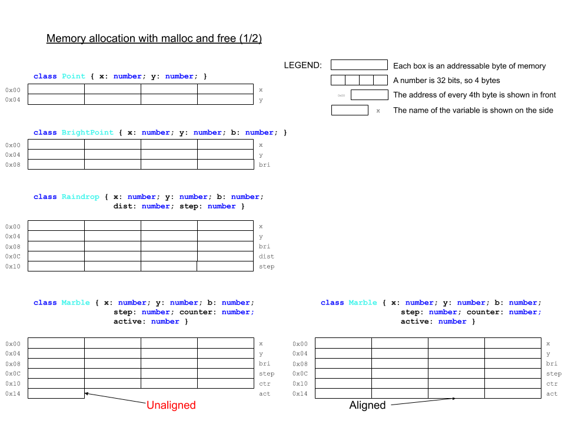

# CPE 1040 - Fall 2020

This is learning progression 004 for the Fall 2020 installment of the course CPE 1040: Introduction to Computer Engineering at MSU Denver.

Table of Contents
=================

* [CPE 1040 \- Fall 2020](#cpe-1040---fall-2020)
  * [Learning Progression 004: External LEDs](#learning-progression-004-external-leds)
    * [Step 2: Data &amp; memory](#step-2-data--memory)
      * [1\. Study](#1-study)
        * [Arrays and memory](#arrays-and-memory)
        * [Memory layout](#memory-layout)
        * [Numeric types, buffers, and caches](#numeric-types-buffers-and-caches)
        * [Addressing](#addressing)
        * [References and pointers](#references-and-pointers)
        * [Types of memory](#types-of-memory)
        * [Memory management](#memory-management)
      * [2\. Apply](#2-apply)
      * [3\. Present](#3-present)


## Learning Progression 004: External LEDs

This progression introduces fundamentals of computing, including the binary system of data representation as well as the basics of memory and processing. We introduce assembly language in the context of a minimal instruction set processor. This is where the lowest layer of the software stack and the highest layer of the hardware stack coexist, and where user programs are translated into machine code and executed by the processor one instruction at a time. This is also the level of computing which directly correpsonds to the simplest theoretical models of a computer. We also introduce the input-output capabilities of the micro:bit and build an external circuit to serve as an extension to the built-in 5x5 LED matrix to run our Screensavers program on.

### Step 2: Data & memory  
[[toc](#table-of-contents)]

#### 1. Study
[[toc](#table-of-contents)]

##### Arrays and memory
[[toc](#table-of-contents)]

Arrays are a ordered collections of data elements, which allow individual elements to be retrieved by their index in the sequence. The index range is [0, N-1], where N is the total number of array elements. Arrays are a close analog to computer memory. Memory is organized as a large array, and the indices of the elements are called _addresses_. Each _byte_ (8-bits) has an address, starting from 0b000 up to the highest address depending on the size of the memory.

What do we mean by "memory"? Memory is a physical device capable of keeping a dynamic record of the _state_ of a _process_ (meaning, an activated program). The state includes all the data the process is working with. For a computer to execute a program, the program itself and the program's data needs to be in the computer's memory.

Here's a very simple sketch of memory, showing all the bits (shown as boxes) in 4 consecutive bytes with addresses shown on the left:
```
       -----------------
0b0000 |0|1|1|1|0|0|0|0|
       -----------------
0b0001 |1|1|0|1|0|1|1|0|
       -----------------
0b0010 |1|0|0|0|1|1|0|1|
       -----------------
0b0011 |0|0|1|1|0|0|1|0|
       -----------------
```
Notice the _fixed bit width_ of data in memory.

Memory has only two basic functions, _Read_ and _Write_.

The most important property of memory is _speed_, in both reading and writing. The second most important property of memory is _capacity_. The more memory a computer has, the better. In the age of _big data_, memory is never enough, often by _orders of magnitude_.

##### Memory layout  
[[toc](#table-of-contents)]

The simplicity of memory devices shift the burden of efficient usage to the software stack. Let's list some of the computational artifacts that we write to and read from memory:
1. We know that memory is _byte-addressed_. Any byte-sized data fits very efficiently into memory. Here are two examples:
   1. [ASCII characters](http://www.asciitable.com/), which are a standard character set used by **all programming languages**, are 7-bits long. This character set is _fixed-length_, where length referes to the number of bytes one character takes. They all take one byte. In contrast, [_Unicode_](https://home.unicode.org/), which is the worldwide standard for representing all symbolic systems used by humanity, including [emoji](https://unicode.org/emoji/charts/full-emoji-list.html), due to its size, has adopted a _variable-length_ format.  
   2. _Machine learning (ML)_ has become an ubiquitous technology and is utilized in all computing environments, from large data centers to the smallest resource-constrained _Internet-of-Things (IoT)_ devices on the _edge_ of the Internet. ML is a _memory-heavy_ (meaining it uses a lot of memory) technology, but in the latter case, memory is severly constrained. The computational artifacts that ML produces are called _models_. These models contain the learned knowledge which machines use to solve the problems they were _trained_ for. The models are large and complex _data structures_. To be able to use such a model on IoT devices, it has to be _compressed_ to fit in their limited memory. One of the techniques is _byte-packing_, which reduces the numerical data of the model to a _byte array_.  
2. Except for memory-constrained applications, data is usually represented in _words_. Today a word is usually 4 bytes, or 32 bits. All _primitive data types_ are represented in words, meaning:
   1. They are read from and written to memory as words.  
   2. The processor works with word-sized _operands_ (e.g. for addition `a + b`, where `a` and `b` are the operands).  
   3. Because both memory and processor work with words, the computer is optimized to work with words, thus making the word-sized data the most efficient to manipulate.  
3. The primitive types that we have encountered are:
   1. Unsigned integers.  
   2. Signed integers.  
   3. Single-precision floating-point numbers.  
   4. Double-precision floating-point numbers (which use 2 words instead of one).  
   5. Booleans.  
      All of these look like bit-patterns in binary. For example, the bit pattern:
      ```
             -----------------------------------------------------------------
      0b0000 |0|0|0|0|0|0|0|0|0|0|0|0|0|0|0|0|0|0|0|0|0|0|0|0|0|0|0|0|0|0|0|0|
             -----------------------------------------------------------------
      ```
      represents 2682257408<sub>10</sub> in unsigned integers, -1612709888<sub>10</sub> in signed integers, or -9.48676900925e-20 in floating-point numbers. _Note that the last number is an example of a short-hand representation of scientific notation. The `e-20` means * 10<sup>-20</sup>._ So, data types are important to distinguish between different interpretation of binary patterns in memory.   
4. Booleans are an interesting case. While a single bit can represent a boolean (0 for `false` and 1 for `true`), memories cannot manipulate (read or write) single bits. So, booleans are represented either by bytes, which are the smallest addressable units of memory, or words, which are the most efficient memory unit. Very often, data that are narrower than words are _word-aligned_ (meaning they are stored in words, with any extra bits set to zero). For example, here is how 4 word-aligned booleans will look in memory (the first two are `false` and the last two are `true`):
   ```
          -----------------------------------------------------------------
   0b0000 |0|0|0|0|0|0|0|0|0|0|0|0|0|0|0|0|0|0|0|0|0|0|0|0|0|0|0|0|0|0|0|0|
          -----------------------------------------------------------------
   0b0004 |0|0|0|0|0|0|0|0|0|0|0|0|0|0|0|0|0|0|0|0|0|0|0|0|0|0|0|0|0|0|0|0|
          -----------------------------------------------------------------
   0b0008 |0|0|0|0|0|0|0|0|0|0|0|0|0|0|0|0|0|0|0|0|0|0|0|0|0|0|0|0|0|0|0|1|
          -----------------------------------------------------------------
   0b000c |0|0|0|0|0|0|0|0|0|0|0|0|0|0|0|0|0|0|0|0|0|0|0|0|0|0|0|0|0|0|0|1|
          -----------------------------------------------------------------
   ```
   Notice the addresses. They are 0<sub>10</sub>, 4<sub>10</sub>, 8<sub>10</sub>, and 12<sub>10</sub>, because each boolean is 4 bytes wide.  
5. The individual elements of arrays are stored _consecutively_ in memory. For example, the previous example may very well be the memory layout of the array `let boolArr : boolean = [false, false, true, true]` provided the micro:bit uses word alignment for booleans.
6. Object data is stored in memory blocks with the cumulative size of the class fields. The following sketch shows this for some familar classes from previous steps:

     

7. Of course, program code is also stored in memory. Here we need to distinguish among the following:
   1. Program source code is stored as regular files in the file system, usually on drives, known as _secondary storage_. For example, `screensavers.js` is a source file.    
   2. Program _compiled_ binaries are stored as regular (though non-human readable) files, usually in _secondary storage_. For example, `microbit-screensavers.hex` is a compiled binary.  
   3. When a program is activated for execution, and becomes a _process_, the following happens:
      1. A process metadata block is created for the program. This contains addresses, identification numbers, and miscellaneous process management data.    
      2. The program's compiled binaries are brought to _main memory_ (aka _primary storage_, the memory we have been talking about so far) in a _code segment_.  
      3. The program's data is also brought to main memory, in a data segment.  
      4. Additional memory for the program's execution is allocated and assigned to it.  
      5. Using the process metadata block, the process is put on a _queue_ (which is just a list where elements are added from one end and removed from the other) of processes ready to execute.  
8. Just as variables are named data, functions and class methods are named code. When a function or method is called, the process knows where the code is. For class methods, they are not stored for each object, but only once for the class. When a method is called on an object, the class code is executed.

##### Numeric types, buffers, and caches
[[toc](#table-of-contents)]

The MakeCode environment silently lumps both integer and floating-point numbers in its `number` type. _Note that the type [`Number`](https://makecode.microbit.org/types/number) (note the capitalized type name) is a 32-bit 2s-complement signed integer, and its support is not very stable at present. Most importantly, the two types `number` and `Number` are not compatible and/or mutually interconvertible, at least in MakeCode, where the [JavaScript-like language we are using to program the micro:bit](https://makecode.com/language) is only a **subset** of TypeScript. For example:_
```javascript
// Example 2.1.1

let f : number = 3.4
basic.showNumber(f)  // this works fine as showNumber takes a `number`-typed argument

let f : Number = 3
basic.showNumber(f)  // this errors out with message "Argument of type 'Number' is not assignable to parameter of type 'number'."
```
So, we can use `Number` variables in our programs, but we cannot use them as arguments to functions which have `number` parameters.

TypeScript (in contrast to JavaScript) supports unsigned and signed integer types with explicit fixed bit-widths:
```javascript
// Example 2.1.2

// Unsigned integer types
let a : uint8                     // range 0 to 255
let b : uint16                    // range 0 to 65536
let c : uint32                    // range 0 to 4294967295

// Signed integer types
let x : int8                      // range -128 to 127
let y : int16                     // range -32768 to 32767
let z : int32                     // range -2147483648 to 2147483647
```
Note the following:
1. The ranges differ in correspondence to the bit width of the type: the larger the width, the larger the range.    
2. The signed integers are 2s-complement, as can be seen from the fact that the negative integers are one more than the positive ones.  

Arrays are not currently supported for these types. Instead of arrays, we can use _buffers_, which in general are unstructured blocks of memory where the programmer has full control over the memory layout. MakeCode supports the type [`Buffer`](https://makecode.microbit.org/types/buffer) for just such purpose. Here is an example:
```javascript
// Example 2.1.3

const BUFF_BYTE_SIZE = 16
let buff : Buffer = pins.createBuffer(BUFF_BYTE_SIZE)

for (let i=0; i<BUFF_BYTE_SIZE; i++) buff.setNumber(NumberFormat.Int8LE, i, 10 * i)

basic.showString("The buffer has size " + buff.length + "bytes")

// Interpret as bytes
basic.showStrint("The contents, in signed bytes, are:")
for (let i=0; i<BUFF_BYTE_SIZE; i++) basic.showNumber(buff.getNumber(NumberFormat.Int8LE, i)

// Interpret as integers
basic.showStrint("The contents, in signed integers, are:")
for (let i=0; i<BUFF_BYTE_SIZE; i+=4) basic.showNumber(buff.getNumber(NumberFormat.Int32LE, i)
```
The buffer works very much like regular memory:
1. It is initialized as some number of _bytes_.  
2. Each of these bytes is individually addressable by index (the second argument of the `setNumber` and `getNumber` functions).  
3. The bytes can be interpreted as parts of [wider types](https://makecode.microbit.org/types/buffer/number-format), e.g. 32-bit signed integers, as shown in the example. Note the step of 4 of the last `for` loop.    

Buffers are best used as transient storage in applications which require a _cache_. A cache is small but fast storage for the most often used computational artifacts and data. Two example applications for buffers are:
1. In input-output operations, data has to travel across a communication channel (usually 1, 2, 3, or more parallel wires, depending on the application). The speed of the channel is usually measured in bits per second (abbr. bps or bits/sec). If the speed of the channel does not match the speed of generation of output data or processing of input data, data would be lost. Buffers can be used to temporarily store data that might otherwise be lost, until the slower side of the buffer catches up with the faster side.  
2. Some functions, especially recursive functions, perform expensive computations and are, on top of that, inefficient. The innefficiency often comes from having to do the same computation multiple times. It's much better to keep a buffer with results of expensive computations, to speed up the overall processing speed. The buffer can be [passed by reference](#references-and-pointers) to the recursive calls.  

More generally, a cache is a small set of objects, which are made available _much faster_ than from their general storage and _much closer_ (physically) to where they are needed. Thus, _caching_ is a widely used algorithmic principle, in computing and widely in engineering.  

##### Addressing  
[[toc](#table-of-contents)]

The following sketch illustrates how memory is accessed:

  

Things to notice:
1. The control line determines if the access is for reading (R) or writing (W). This is usually a single line (that is, 1 bit).    
2. The data lines carry the value to be written or the value read, depending on the control line. It is as wide as there are bits (either 1 or 8 on the sketch).  
3. When accessing a single bit or a single byte, we do not need address lines.  
4. The address lines carry the value of the address. They are as many as necessary. On the bottom of the sketch, we have 8 bytes, each of which can be read or written independently. For this to happen, it needs to be _exclusively_ selected (that is, it and only it is selected, with the others deselected). For 4 different selector lines (one for each of the bytes), we can have a 2-bit address. Why? Because 4 different numbers can be represented with 2 bits (`0b00`, `0b01`, `0b10`, and `0b11`). The _2-to-4 decoder_ is a circuit which performs the following translation:

Address (2 bits) | Selector (4 bits)
--- | ---
00 | 0001
01 | 0010
10 | 0100
11 | 1000

A line is selected when it carries a value of 1 and deselected when it carries a value of 0.  

**Question 2.1.1:** How many different selector lines can we control (that is, decode) with a 4-bit address?  

##### References and pointers
[[toc](#table-of-contents)]

Now that we know about memory addresses, we can recall the short mention of references from a previous step. References are the programmatic equivalents of addresses, a sort of "invisible addresses". When arguments are passed to a function, they are either copied (pass _by value_) or referenced (pass _by reference_). To the programmer, this difference is invisible in most languages, JavaScript included. The difference is implemented based on the type of the argument: pass by value for primitive types, pass by reference for arrays and objects. While the programmer does not see the addresses themselves, reference-type _identifiers_ (meaning variable and function names) are matched to memory addresses when a program is activated and executed.

Some languages, most notably C and C++, have explicit reference types, called _pointers_. Here is a small example:
```c
// Example 2.1.4

int i = 6;                                                 // just a 32-bit signed integer variable, with a type `int`
int *ptr = &i;                                             // a pointer variable, also 4 bytes, holding the address of i
                                                           // the type of ptr is `int *`, a pointer to an integer

printf("Integer %d, pointer dereference %d\n", i, *ptr);   // a pointer can be dereferenced to show the value at the address it holds
```
Thus, languages like C and C++ give very low-level control over program memory than most other languages, including Java and JavaScript, where memory operations are invisible to the programmer and out if their direct control.

##### Types of memory
[[toc](#table-of-contents)]

The elements of an array are stored in memory _continguously_ (meaning one after the other without gaps). This supports a very simple and efficient mechanism for element selection by index. The address of a particular element is calculated with the formula _base address + index * base type size_. Here is a sketch for illustration:

  

There is a most important consequence of this mechanism, namely that the access of any element takes _constant time_ (meaning it doesn't depend on the size of the array or the size of the individual elements or their order or their particular index).

Memory works the same way: any address is accessed as fast as any other. This is important during execution, because a process has code and data in different segments of memory, sometimes far apart from each other. As a process executes, it tends to access memory at random. This is called _random access_, which gives the primary-storage (aka _main_) memory the name _Random Access Memory (RAM)_. The current version of the micro:bit has [16KB](https://tech.microbit.org/hardware/1-5-revision/#nrf51-application-processor) (read as 16 _kilobytes_) of RAM. The upcoming [version 2](https://tech.microbit.org/hardware/#nrf52-application-processor) has 128KB, or 8 times larger. A [modern machine learning workstation](https://lambdalabs.com/gpu-workstations/vector/customize) can have up to 256GB (read as 256 _gigabytes_), or about 16 million times larger than the current micro:bit.  

RAM, usually called main memory, is used as dynamic data storage **only** during process execution. It is _volatile_ memory (meaining the data is lost when the device is turned off). This is so for the micro:bit as well. One of the first significant programs written for the micro:bit shortly after its launch, the game [`Bitflyer`](https://hackernoon.com/the-first-video-game-on-the-bbc-micro-bit-probably-4175fab44da8) shows the layout of the 16KB of RAM (it lacks a table of contents, so just find the **Memory** section) in color, pointing out the different regions and their clients. Note that this is just a snapshot and is not the permanent structure of the RAM, which is just a large array. All data in the array needs to be interpreted by the memory client to make sense. (Note that this is for a program written in MicroPython, not TypeScript.)

The micro:bit stores its programs in a different memory device, which is called [Flash ROM](https://tech.microbit.org/hardware/1-5-revision/#nrf51-application-processor), of which v1.5 has 256KB and v2 has 512KB. Let's unpack this:
1. [Flash](https://en.wikipedia.org/wiki/Flash_memory) is a type of memory device. It is _non-volatile_ (meaning the data doesn't get erazed when the device is turned off). Disconnecting the micro:bit from the battery pack and the USB cable turnes it off, but the program on it doesn't get lost or change until the device is back on and re-programmed.  
2. ROM stands for _Read-Only Memory_, which is self-explanatory. The program code is only read from the Flash ROM during process execution.  
3. The Flash ROM, of course, is not a memory to which we cannot write at all. The process of programming the micro:bit (by "dropping" the hex file onto the micro:bit "drive") is a process of _writing_ the program memory. It is performed by the so called [interface chip](https://tech.microbit.org/hardware/1-5-revision/#interface), which mediates between the USB channel, connected to the programming computer, and the [application processor](https://tech.microbit.org/hardware/1-5-revision/#nrf51-application-processor). The process is shown schematically on the [micro:bit software overview page](https://tech.microbit.org/software/) and described in more detail [here](https://tech.microbit.org/software/daplink-interface/). The interface chip has a program, called [_firmware_](https://microbit.org/get-started/user-guide/firmware/), which receives the program in the form of a HEX file and programs the application processor.

##### Memory management
[[toc](#table-of-contents)]

Memory management, for both RAM and ROM, is usually implemented in the lowest levels of the software stack, as shown in the familiar sketch:


This is because of the following crucial roles of memory in a computer:
1. **Isolation.** The memory regions of different processes have to be isolated, and this include no exposing memory management functions to the programmatic layer of the stack.  
2. **Speed.** The processor of a computer runs much faster than the memory management mechanisms. Therefore, in order to keep the processor busy, the computer's memory is built as a hierarchy of hardware and software components. The following diagram shows the memory pyriamid with various components we mentioned:

     

   [[Image credit](https://en.wikipedia.org/wiki/Memory_hierarchy)]  


#### 2. Apply
[[toc](#table-of-contents)]

1. The _hexadeximal_ number system is frequently used in computing (e.g. the micro:bit HEX files, and to show memory addresses that are too big to show in binary). "Hexadeci-" means 16. Questions and tasks:  
   1. What is the base of hexadecimal?  
   2. What are the symbols of hexadecimal? List them.  
   3. How many bits can represent the same number of different numbers as one _hexadigit_?  
   4. Using your answer to the previous question, describe a simple procedure to convert numbers from binary to hexadecimal, and vice versa.  

2. Write a function `bin2Hex(bin : string) : string` which takes a binary integer string and returns the corresponding hexadecimal integer string (e.g. for input `0b00001111`, the output is `0x0F`). Guidelines and hints:
   1. Assume the argument `bin` will have the prefix for binary.  
   2. You might need to _pad_ the argument string. What is padding? If I need a string to be of some particular length (or width for binary number strings), say 8 bits, and I have an input like `0b111`, I can pad this string on the left with `0`-s to get the equivalent 8-bit number strging `0b00000111`.  
   3. The output string should have the prefix for hexadecimal.  

3. Write a function `hex2Bin(hex : string) : string` which takes a hexadecimal integer string and returns the corresponding binary integer string (e.g. for input `0x0F`, the output is `0b00001111`). Use prefixes.  

4. **[Optional challenge, max 5 extra step points]** _Databases_ are large containers for data, usually organized in _tables_. Tables resemble multidimensional arrays with the important difference that different _columns_ may have different data types. One of the drawbacks of arrays and database tables is that sorting them in place is inefficient. It takes a lot of copying, consuming memory and processing time. So what do we do if we have a database table that is already sorted by, say, record identification number, and is too large to sort otherwise? How can we still get a column of interest in a sorted order? We create an _index_ on that database column, and leave the table records untouched. Take a look at the following code:
   ```javascript
   class Record {
       _id : number
       _word : string

       constructor(id : number, word : string) {
           this._id = id
           this._word = word
       }

       get id() {
           return this._id
       }

       set id(new_id : number) {
           this._id = new_id
       }

       get word() {
           return this._word
       }

       set word(new_word : string) {
           this._word = new_word
       }
   }

   let wordlist : string[] = ["tearful","watery","eyes","pump","halting","wonderful","wine","flesh","explain","heap","substantial","scare","coherent","amusing","settle","lyrical","copy","insurance","impress","frightening","produce","slope","abounding","spicy","futuristic","bedroom","teaching","throne","punish","macho","overjoyed","enjoy","cure","busy","well-made","energetic","crayon","mushy","flippant","things","rinse","steep","incandescent","past","concerned","hurt","terrific","decision","farm","birds"]

   let records : Record[] = []

   for (let i=0; i<wordlist.length; i++) records.push(new Record(randint(0, 10000), wordlist[i]))

   // 1. sort by id
   records.sort((value1 : Record, value2 : Record) : number => {
       return value1.id() - value2.id()
   })

   basic.showString('OK')
   basic.showNumber(records[0].id())
   basic.showNumber(records[records.length-1].id())

   // 2. create an index on word
   let index : number[] = []

   for (let i=0; i<records.length; i++) index.push(i)
   ```
   1. To simulate a database table, we declare a `Record` class with two fields of different type, and then we create an array or records.  
   2. The identification numbers `id` are random integers. We sort the "table" by `id`. Note the declaration syntax for a non-default `sort` function, which involes declaring a [`compareFunction`](https://developer.mozilla.org/en-US/docs/Web/JavaScript/Reference/Global_Objects/Array/sort).  
   3. We can now create an index array for the second column `word`. It contains the _indices_ of the table array.  
   4. You need to write the code to sort the index by `word`. The following sketch shows what you need to do:
   
        

5. **[Optional super challenge, max 16 extra step points]** By virtue of most operating systems and machine learning platforms being written in C/C++, the most popular memory management code is the [`malloc`+`free`](https://en.cppreference.com/w/c/memory/malloc) duo from the [C Standard Library](https://en.wikipedia.org/wiki/C_standard_library). We will simulate their function. Take a look at the [memory layout sketch](#memory-layout) and the following code:
   ```javascript
   // memory footprint in bits
   enum MemoryFootprint {
       DEADBEEF = 0,               // empty (available)
       Point = 64,                 // number: x, y
       BrightPoint = 96,           // number: x, y, brightness
       Raindrop = 160,             // number: x, y, brightness, distance, step
       Marble = 168,               // number: x, y, brightness, step, counter; boolean: active
       MarbleAligned = 192         // number: x, y, brightness, step, counter, active
   }

   // heap : assume a byte array (i.e. each array index is the address of a byte)
   let heap : number[] = []
   const HEAP_BYTE_SIZE : number = 50
   
   // "zero-out" the heap
   for (let i=0; i<HEAP_BYTE_SIZE; i++) heap.push(0)

   // heap management (allocations)
   enum Alloc { StartAddr = 0, NumBytes }
   let alloc : Alloc[] = []

   // memory management API
   function malloc(bytes : number) : number {
       /* TODO */

       return null
   }

   function free(addr : number) : void {
      /* TODO */
   }

   // microbit memory guard
   basic.showString('OK')
   ```
   1. We define an enumerated type `MemoryFootprint` to define how much memory (in bits) is taken to store the data of an object of each of several screensaver types. The sketch shows this visually.    
   2. We declare a _heap_ of free memory available for dynamic allocation (meaning during process execution). This is the memory block the functions `malloc` and `free` will manage, fullfilling requests from memory clients. We assume that `heap` is an array of bytes.    
   2. The function `malloc` (standing for _memory allocate_) finds a suitable place to store the number of bytes in its argument, marks them as _unavailable_ (e.g. store a `1` in the heap "bytes") and returns the address to the caller. The address is the heap array index of the first "byte" in the new allocation. 
   3. Notice that to `malloc` memory is just blocks of bytes. It does not know about object types or their memory footprint. The `MemoryFootprint` type is simply provided for readability in the `malloc` calls (e.g. "I want an array of 5 `Raindrop`-s" translates to `5 * MemoryFootprint.Raindrop` as the argument to `malloc`).   
   4. The function `free` takes the address of the allocation and marks the allocated bytes as _available_ (e.g. by setting the "bytes" to zero).  
   5. Note that the size of each allocation is not passed as an argument to `free`, and is only present in `malloc`. This means that we need to keep track of the size (in bytes) of each allocation. This is the function of the `alloc` array. The following sketch shows the effect of several calls to `malloc` and `free`: 
   
       
     
      Notice that, because of the unpredictable sequence of allocations and free-ups an executing process generates, the heap becomes _fragmented_. There are two _policies_ which are used to look for a free "hole" to fit a new allocation, _first-fit_ (which finds the first hole that is large enough w/o regard for fragmentation) and _best-fit_ (which finds the first hole that is as large as the allocation but, if possible, no larger).  
   6. Use the scenarios in the sketch to compose a sequence of `malloc` and `free` calls to test your code.  
   7. To provide visual evidence that your code is working, notice that the heap is declared to be 50 "bytes", and write code to show on the 5x5 LED matrix whether each 2-byte block is free (dark LED) or occupied (lit LED).  
      
6. **[Optional challenge, max 10 extra step points]** Take your program from 2.2.5 and rewrite it using a `Buffer` for the heap.    


#### 3. Present 
[[toc](#table-of-contents)]

In the [programs](programs) directory:
1. Add your program from 2.2.2 with filename `microbit-program-2-2-2.js`.  
2. Add your program from 2.2.3 with filename `microbit-program-2-2-3.js`.  
3. Add your program from 2.2.4 with filename `microbit-program-2-2-4.js`.  
4. Add your program from 2.2.5 with filename `microbit-program-2-2-5.js`.  
4. Add your program from 2.2.6 with filename `microbit-program-2-2-6.js`.  

In the [Lab Notebook](README.md):

1. Answer question 2.1.1.  
2. Answer the questions and show your work for 2.2.1 in well-formatted Markdown, including whatever images, tables, or other graphical elements you find necessary. 
3. Link to the program from 2.2.2.  
4. Link to a demo video showing the execution of the program from 2.2.2.  
5. Link to the program from 2.2.3.  
6. Link to a demo video showing the execution of the program from 2.2.3.  
7. Link to the program from 2.2.4.  
8. Link to a demo video showing the execution of the program from 2.2.4.  
9. Link to the program from 2.2.5.  
10. Link to a demo video showing the execution of the program from 2.2.5.  
11. Link to the program from 2.2.6.  
12. Link to a demo video showing the execution of the program from 2.2.6.  
